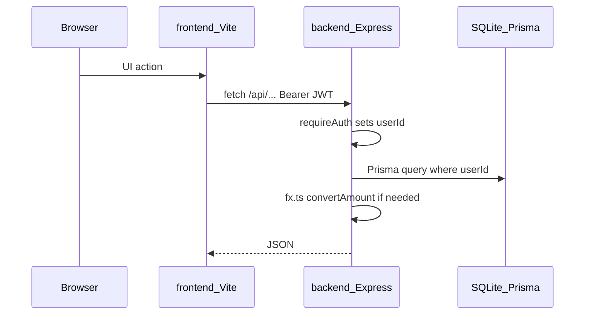

# Architecture

Monorepo: Express API (`backend/`) + Vite React SPA (`frontend/`). SQLite via Prisma. All user data is scoped by `userId` from JWT.

## Request flow

| Layer | Entry | Role |
|-------|--------|------|
| Frontend | `frontend/src/api/client.ts` | `fetch` + `Authorization: Bearer` from `localStorage` |
| Auth | `backend/src/auth.ts` | Register/login, `requireAuth` middleware |
| HTTP | `backend/src/app.ts` | All REST routes (~single file) |
| FX | `backend/src/fx.ts` | NBP rates, PLN hub, in-memory TTL cache |
| Holdings | `backend/src/holdingLot.ts` | `quantityAfter`, lot price resolution |
| Cash ledger | `backend/src/transactionBalance.ts` | `balanceAfter`, transaction types |
| Valuations | `backend/src/accountValuation.ts` | Daily snapshots, backfill |
| Net worth | `backend/src/netWorth.ts` | Aggregated stats for dashboard |

## Auth

- Register/login return JWT (`signToken`, 7-day expiry).
- Protected routes use `requireAuth`: header `Authorization: Bearer <token>`.
- `AuthedRequest.userId` is set on success; queries must filter by `userId`.
- Public (no JWT): `POST /api/auth/register`, `POST /api/auth/login`.

Env (see [README.md](../README.md)): `DATABASE_URL`, `JWT_SECRET` (≥32 chars). Do not commit `.env` or `*.db`.

## Multi-currency

- Amounts stored in original `currency` on models.
- Display currency comes from query `?currency=PLN` on stats endpoints.
- Conversion uses `getFxRatesPlnPerUnit()` + `convertAmount()` — never reimplement in handlers.
- FX is fetched from NBP inside handlers; there is no public `/api/fx/rates` endpoint.

## Where to add features

| Change | Primary files | Also update |
|--------|---------------|-------------|
| New REST route | `backend/src/app.ts` | `frontend/src/api/*`, [api.md](api.md) |
| New Prisma model/field | `backend/prisma/schema.prisma` + migration | [domain.md](domain.md) |
| New page/route | `frontend/src/App.tsx` + component | [frontend.md](frontend.md) |
| New chart/KPI | `backend/src/app.ts` stats routes + `statsApi.ts` | [api.md](api.md) |

## Related docs

- [fullstack-architecture-practices.md](fullstack-architecture-practices.md) - general fullstack architecture principles with repo examples
- [domain.md](domain.md) — data model
- [api.md](api.md) — route catalog
- [frontend.md](frontend.md) — UI routes and API clients
