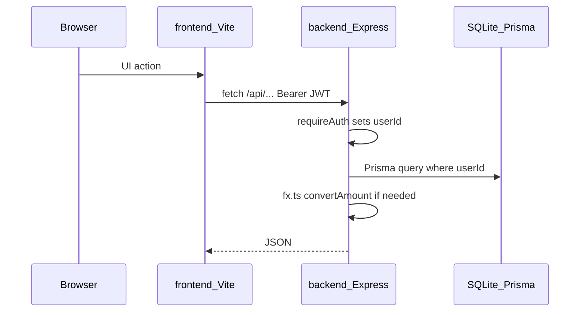

# Architecture

Monorepo: Express API (`backend/`) + Vite React SPA (`frontend/`). SQLite via Prisma. User-owned data (accounts, transactions, holdings) is scoped by `userId` from JWT. The `Instrument` catalog and `InstrumentValuation` price history are **shared globally** across authenticated users (see [domain.md](domain.md)).

## Request flow

| Layer | Entry | Role |
|-------|--------|------|
| Frontend | `frontend/src/api/client.ts` | `fetch` + `Authorization: Bearer` from `localStorage` |
| Auth | `backend/src/auth.ts` | Register/login, `requireAuth` middleware |
| HTTP | `backend/src/app.ts` + `backend/src/routes/*` | Router wiring; domain handlers in route modules |
| FX | `backend/src/fx.ts` | NBP rates, PLN hub, in-memory TTL cache |
| Holdings | `backend/src/holdingLot.ts` | `quantityAfter`, lot price resolution |
| Cash ledger | `backend/src/transactionBalance.ts` | `balanceAfter`, transaction types |
| Valuations | `backend/src/accountValuation.ts` | Daily snapshots, backfill |
| Market data | `backend/src/marketData.ts`, `marketDataSync.ts` | Twelve Data EOD fetch, sync job |
| Net worth | `backend/src/netWorth.ts` | Aggregated stats for dashboard |
| Tax (PL) | `backend/src/tax/*` | PIT-38 report, overview, wrappers, calendar, pre-sell simulator |

Domain modules live under `backend/src/` (flat hubs such as `accountValuation.ts`, `holdings.ts`) and grouped folders where cohesion is high (`tax/`, `import/`, `routes/`). See [fullstack-architecture-practices.md](fullstack-architecture-practices.md) §12.

## Auth

- Register/login return JWT (`signToken`, 7-day expiry).
- Protected routes use `requireAuth`: header `Authorization: Bearer <token>`.
- `AuthedRequest.userId` is set on success; queries must filter by `userId`.
- Public (no JWT): `POST /api/auth/register` (when `ALLOW_REGISTER` is not false), `POST /api/auth/login`, `GET /api/auth/config`, `GET /api/health`.
- Private deploy: set `ALLOW_REGISTER=false`; create users via `npm run create-user`. Backups: `npm run db:backup`. See [private-ops.md](private-ops.md).

Env (see [README.md](../README.md)): `DATABASE_URL`, `JWT_SECRET` (≥32 chars), optional `ALLOW_REGISTER`, `MARKET_DATA_API_KEY`. Do not commit `.env` or `*.db`.

## Multi-currency

- Amounts stored in original `currency` on models.
- Display currency comes from query `?currency=PLN` on stats endpoints.
- Conversion uses `getFxRatesPlnPerUnit()` + `convertAmount()` — never reimplement in handlers.
- FX is fetched from NBP inside handlers; there is no public `/api/fx/rates` endpoint.

## Market data (EOD)

- `MARKET_DATA_API_KEY` enables Twelve Data EOD quotes for held **STOCK**, **ETF**, and **crypto** (holdings on `CRYPTO` accounts or `instrumentType=CRYPTO`; pair format e.g. `BTC/USD`).
- `POST /api/market-data/sync` (or `npm run market:sync` in `backend/`) upserts `InstrumentValuation` with `source: twelve_data` and recomputes affected brokerage account snapshots via `recomputeAccountValuationsFrom`.
- Symbol mapping (`marketDataSymbols.ts`): US exchanges use bare ticker; GPW → `:WAR`, XETRA → `:XETR`, etc. Unmapped types/exchanges are skipped (use manual valuation UI).
- Scheduled sync: run `npm run market:sync` from cron on weekdays after market close (see [README.md](../README.md)).

## Where to add features

| Change | Primary files | Also update |
|--------|---------------|-------------|
| New REST route | `backend/src/routes/<area>Routes.ts` (wire in `app.ts`) | `frontend/src/api/*`, [api.md](api.md) |
| New Prisma model/field | `backend/prisma/schema.prisma` + migration | [domain.md](domain.md) |
| New page/route | `frontend/src/App.tsx` + component | [frontend.md](frontend.md) |
| New chart/KPI | `backend/src/routes/statsRoutes.ts` + `statsApi.ts` | [api.md](api.md) |

## Persistence and scaling

SQLite fits local/MVP usage (single writer, simple backup). Valuation recompute and holdings summaries preload related rows in memory to avoid per-day/per-instrument query loops. If the product moves to multi-user hosted production, consider Postgres for write concurrency and background valuation jobs.

## Related docs

- [fullstack-architecture-practices.md](fullstack-architecture-practices.md) - general fullstack architecture principles with repo examples
- [domain.md](domain.md) — data model
- [api.md](api.md) — route catalog
- [frontend.md](frontend.md) — UI routes and API clients
