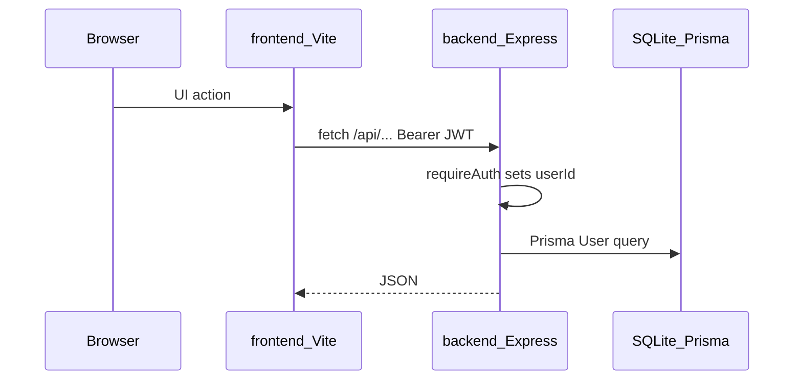

# Architecture

Hub: [docs/README.md](../README.md).

Monorepo: Express API (`backend/`) + Vite React SPA (`frontend/`). SQLite via Prisma. **Baseline:** `User`, nested `Category` tree (defaults on register), user-scoped `Account` (allow-listed types), and `CashTransaction` ledger (INCOME/EXPENSE, optional `categoryId`). Product backlog: [mvp/CHECKLIST.md](../../mvp/CHECKLIST.md).

Local development: Vite (`:5173`) + API (`:4000`). Production Docker: one Express process serves `/api` and the Vite `dist` (SPA fallback for non-API routes).

## Request flow

| Layer | Entry | Role |
|-------|--------|------|
| Frontend | `frontend/src/api/client.ts` | `fetch` + `Authorization: Bearer` from `localStorage` |
| Auth helpers | `backend/src/auth.ts`, `authConfig.ts` | Password/JWT validation, `requireAuth`, register flag |
| HTTP | `backend/src/app.ts`, `httpConfig.ts` + `routes/mountRouters.ts` | Health, Helmet/CORS, static SPA, rate limits, mounts auth + accounts + categories + cash-tx + statistics routers |
| Auth routes | `backend/src/routes/authRoutes.ts` | Register/login/me/profile/email/password; register seeds default categories |
| Accounts routes | `backend/src/routes/accountsRoutes.ts` | Account CRUD (user-scoped; type allow-list) |
| Categories routes | `backend/src/routes/categoriesRoutes.ts` | Nested category CRUD |
| Cash tx routes | `backend/src/routes/cashTransactionsRoutes.ts` | Nested INCOME/EXPENSE ledger (optional category) |
| Statistics routes | `backend/src/routes/statisticsRoutes.ts` | Category breakdown, period summary, cashflow history, net worth, rolling 12m |
| Errors | `routes/httpSupport.ts`, `lib/errors.ts` | Typed HTTP errors (incl. 409 conflict) |
| Scripts | `backend/src/scripts/` | `createUser` (seeds categories), `backupDb` |
| Seed | `backend/prisma/seed.ts`, `domain/seedDemoPortfolio.ts` | Demo user + wipe/rebuild sample portfolio |

Money and conversion rules belong in dedicated backend modules when FX/valuations land — not duplicated in route handlers or the UI. See [fullstack-practices.md](fullstack-practices.md).

## Auth

- Register/login return a JWT (`signToken`, HS256, 7-day expiry) that includes `userId` and `tokenVersion`.
- Register (when allowed) atomically creates the user and seeds a default Income/Expense category tree. Duplicate email or username (case-insensitive) returns `409`.
- Protected routes use `requireAuth`: header `Authorization: Bearer <token>`. The user must still exist and the token's `tokenVersion` must match. A password change increments `tokenVersion`, so older tokens receive `401`.
- A wrong current password on email or password change is `400` and does not clear the session. The frontend logs out only when an API call returns session `401`.
- `ALLOW_REGISTER=false` blocks register and hides Sign up in the UI (`GET /api/auth/config`).
- Frontend: `AuthProvider` loads `/api/auth/me` when a token exists; session `401` clears the token and redirects to `/login`. Token storage today is `localStorage` (`finance_dashboard_token`). Planned: same JWT in an HttpOnly cookie — [MVP-004](../../mvp/features/auth/jwt-httponly-cookie.md).

## Frontend shell

- Guests: Landing; Login/Register inside `AuthSwapShell` (50/50 form + visual; sides swap by route).
- Authed: AppShell sidebar + topbar with Dashboard, Accounts, Categories, Statistics, Settings; account detail `/accounts/:id` for cash ledger; global currency in topbar (`CurrencyProvider`); default post-login path `/dashboard` (`/home` redirects).

## Related

- [code-map.md](../meta/code-map.md) — path index
- [api.md](../reference/api.md) — route catalog
- [domain.md](../reference/domain.md) — `User`, `Category`, `Account`, `CashTransaction` models
