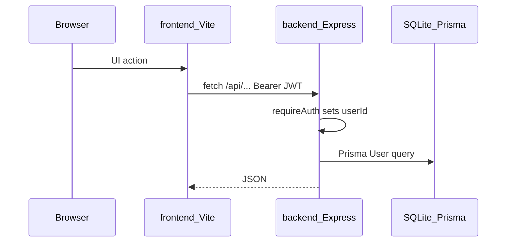

# Architecture

Hub: [docs/README.md](../README.md).

Monorepo: Express API (`backend/`) + Vite React SPA (`frontend/`). SQLite via Prisma. **Auth-only baseline:** the only persistence model is `User`. Product backlog: [mvp/CHECKLIST.md](../../mvp/CHECKLIST.md).

## Request flow

| Layer | Entry | Role |
|-------|--------|------|
| Frontend | `frontend/src/api/client.ts` | `fetch` + `Authorization: Bearer` from `localStorage` |
| Auth helpers | `backend/src/auth.ts`, `authConfig.ts` | Password/JWT validation, `requireAuth`, register flag |
| HTTP | `backend/src/app.ts` + `routes/mountRouters.ts` | Health, rate limits, mounts auth router |
| Auth routes | `backend/src/routes/authRoutes.ts` | Register/login/me/profile/email/password |
| Errors | `routes/httpSupport.ts`, `lib/errors.ts` | Typed HTTP errors |
| Scripts | `backend/src/scripts/` | `createUser`, `backupDb` |
| Seed | `backend/prisma/seed.ts` | Login-only demo user |

When domain features return (accounts, FX, tax, …), keep money and conversion rules in dedicated backend modules — not in route handlers or the UI. See [fullstack-practices.md](fullstack-practices.md).

## Auth

- Register/login return JWT (`signToken`, 7-day expiry).
- Protected routes use `requireAuth`: header `Authorization: Bearer <token>`.
- `ALLOW_REGISTER=false` blocks register and hides Sign up in the UI (`GET /api/auth/config`).
- Frontend: `AuthProvider` loads `/api/auth/me` when a token exists; 401 clears token and redirects to `/login`.

## Frontend shell

- Guests: Landing, Login, Register.
- Authed: AppShell with Home + Settings; default post-login path `/home`.

## Related

- [code-map.md](../meta/code-map.md) — path index
- [api.md](../reference/api.md) — route catalog
- [domain.md](../reference/domain.md) — `User` model
