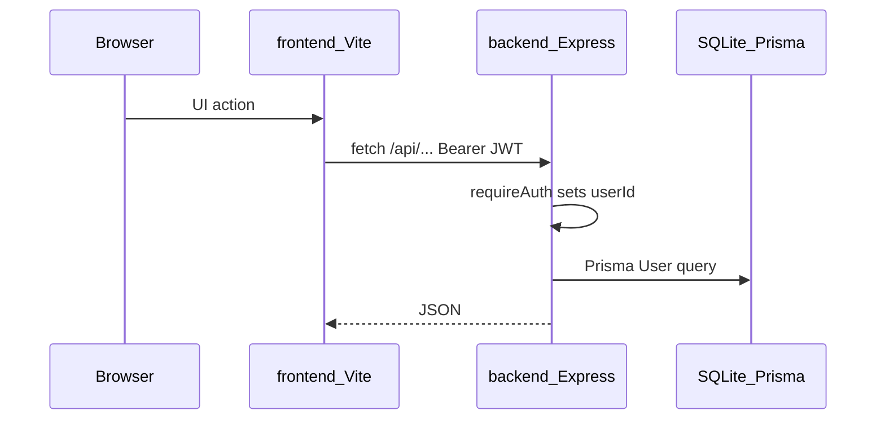

# Architecture

Hub: [docs/README.md](../README.md).

Monorepo: Express API (`backend/`) + Vite React SPA (`frontend/`). SQLite via Prisma. **Baseline:** `User`, nested `Category` tree (defaults on register), user-scoped `Account` (allow-listed types), and `CashTransaction` ledger (INCOME/EXPENSE, optional `categoryId`). Product backlog: [mvp/CHECKLIST.md](../../mvp/CHECKLIST.md).

## Request flow

| Layer | Entry | Role |
|-------|--------|------|
| Frontend | `frontend/src/api/client.ts` | `fetch` + `Authorization: Bearer` from `localStorage` |
| Auth helpers | `backend/src/auth.ts`, `authConfig.ts` | Password/JWT validation, `requireAuth`, register flag |
| HTTP | `backend/src/app.ts` + `routes/mountRouters.ts` | Health, rate limits, mounts auth + accounts + categories + cash-tx + statistics routers |
| Auth routes | `backend/src/routes/authRoutes.ts` | Register/login/me/profile/email/password; register seeds default categories |
| Accounts routes | `backend/src/routes/accountsRoutes.ts` | Account CRUD (user-scoped; type allow-list) |
| Categories routes | `backend/src/routes/categoriesRoutes.ts` | Nested category CRUD |
| Cash tx routes | `backend/src/routes/cashTransactionsRoutes.ts` | Nested INCOME/EXPENSE ledger (optional category) |
| Statistics routes | `backend/src/routes/statisticsRoutes.ts` | Month category income/expense breakdown |
| Errors | `routes/httpSupport.ts`, `lib/errors.ts` | Typed HTTP errors (incl. 409 conflict) |
| Scripts | `backend/src/scripts/` | `createUser` (seeds categories), `backupDb` |
| Seed | `backend/prisma/seed.ts` | Demo user + default categories if missing |

Money and conversion rules belong in dedicated backend modules when FX/valuations land — not duplicated in route handlers or the UI. See [fullstack-practices.md](fullstack-practices.md).

## Auth

- Register/login return JWT (`signToken`, 7-day expiry).
- Register (when allowed) atomically creates the user and seeds a default Income/Expense category tree.
- Protected routes use `requireAuth`: header `Authorization: Bearer <token>`.
- `ALLOW_REGISTER=false` blocks register and hides Sign up in the UI (`GET /api/auth/config`).
- Frontend: `AuthProvider` loads `/api/auth/me` when a token exists; 401 clears token and redirects to `/login`.

## Frontend shell

- Guests: Landing; Login/Register inside `AuthSwapShell` (50/50 form + visual; sides swap by route).
- Authed: AppShell hatch-folio (mast + page) with Home, Accounts, Categories, Statistics, Settings; account detail `/accounts/:id` for cash ledger; default post-login path `/home`.

## Related

- [code-map.md](../meta/code-map.md) — path index
- [api.md](../reference/api.md) — route catalog
- [domain.md](../reference/domain.md) — `User`, `Category`, `Account`, `CashTransaction` models
